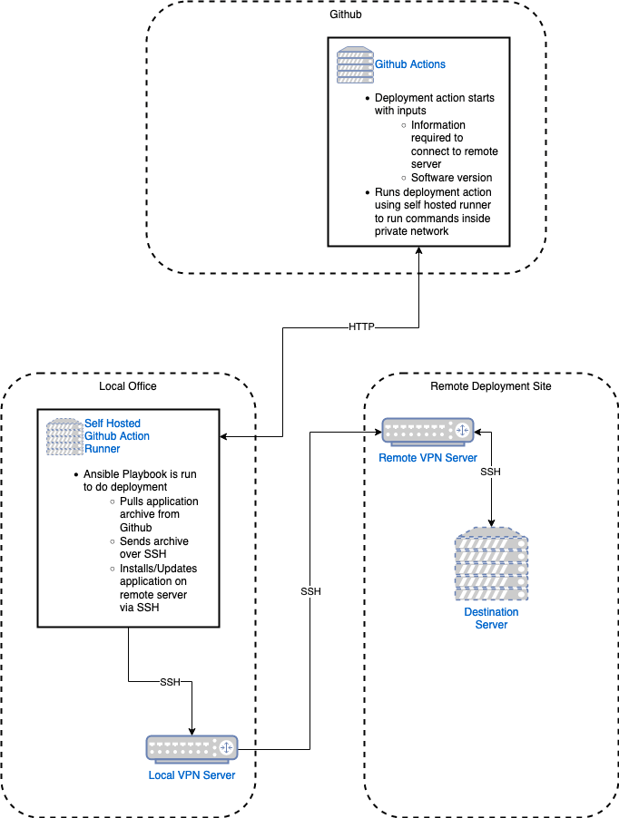

# Github Action Deployment over SSH

This deploys a sample docker container to a remote server using only SSH connections. The deployment action sets up and calls an Ansible playbook that performs the install on the remote SSH server.

The deploy software action uses `workflow_dispatch` event trigger which can be called manualy from the actions page or called using an API call from other software. The workflow requires two inputs, the hostname and the release version. If this should be run more like a cron job, this could be changed to a [schedule](https://docs.github.com/en/actions/using-workflows/events-that-trigger-workflows#schedule) event.

The deployment is run on a self hosted Github action runner that would be located within the private network and have access to SSH on the remote server. A SSH connection through a VPN would look the same as a local SSH box locked down.

## Github Actions

* [deploy-software.yaml](.github/workflows/deploy-software.yml) - This action deployes the software via an Ansible playbook, this actions runs on a self hosted runner
  * [ansible/deploy.yaml](ansible/deploy.yaml) - Ansible playbook to perform deployment, the steps include
    * Download tar archive from Github release
    * Copy tar acrhive to remote server
    * Import tar archive into Docker images on remote server
    * Starts docker container on remote server
* [docker-image.yaml](.github/workflows/docker-image.yml) - Creates tar archive of Docker image and saves it to Github release when a tag like v1.0.0 is created

## Folders

* [.github/workflows](.github/workflows/) - Github actions
* [ansible](ansible/)  - Ansible code that is called from the Github action workflow
* [application](appliction) - Sample docker image running nginx with static page

## Local Servers

The servers localy include:

* Self hosted Github runner running Ubuntu Linux, the installed software includes
  * Docker
  * Ansible
* Test box with docker installed and SSH keys allowing runner to connect and sudo
